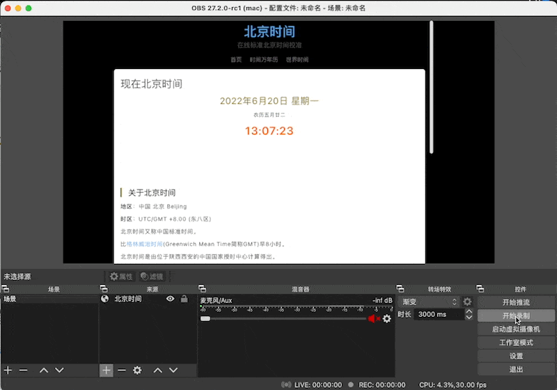
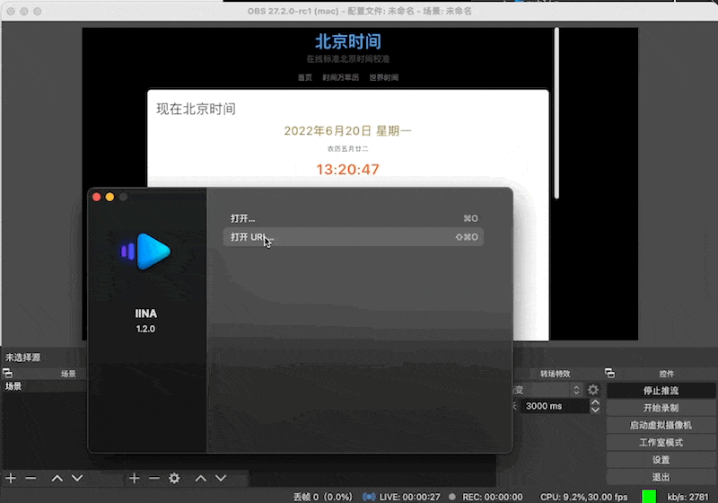

<!--
 * @Description: 
 * @Author: LLiuHuan
 * @Date: 2022-04-11 16:30:02
 * @LastEditTime: 2022-06-20 13:22:39
 * @LastEditors: LLiuHuan
-->
### Introduce
> 由于nginx-http-flv-module官方镜像是四年前的，想弄个最新版的，就自己打了一个包，这个项目仅作为保留使用  
1. 本项目使用最新版 `nginx-http-flv-module` 目前版本为 `1.2.10`  
2. rtmp和http nginx 解析都为 stream

### Use
1. Run container  
  `docker run --name flv -p 31935:1935 -p 39000:9000 -itd lliuhuan/nginx-http-flv-module`  
2. Using OBS and other software to push streams  
  ```
  Server: rtmp://127.0.0.1:31935/stream
  Secret Key: t55
  ```  
    
3. Play using IINA or other HTTP video playback tools  
  `http://127.0.0.1:39000/stream?app=stream&stream=t55`
  

### Build images by workflow

Automatically execute workflow, build Docker image, and upload Docker Hub when push tag is v*

#### 1. Add secrets in this repo:

  1. Add your Docker account and password in the settings -> secrets
  ```
  DOCKER_USERNAME is your Docker account
  ACCESS_TOKEN is your Docker password
  ```
  

#### 2. Push tag about v*

### References
- https://github.com/alfg/docker-nginx-rtmp/blob/master/Dockerfile
- https://github.com/nginxinc/docker-nginx/blob/6f0396c1e06837672698bc97865ffcea9dc841d5/mainline/alpine-perl/Dockerfile
- https://github.com/winshining/nginx-http-flv-module/blob/master/README.CN.md
- https://www.jianshu.com/p/123df9333db0
- https://blog.csdn.net/syy014799/article/details/121885306
- https://blog.csdn.net/a_917/article/details/121473954
- https://hub.docker.com/r/mycujoo/nginx-http-flv-module
- https://blog.csdn.net/a_917/article/details/106709928
- https://blog.csdn.net/Prinz_Corn/article/details/120746676
- https://blog.csdn.net/xjcallen/article/details/107174374
- 
